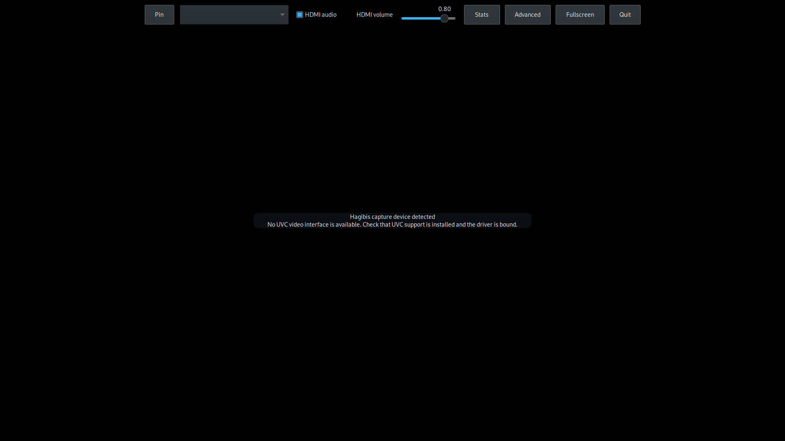

# CaptureViewer

CaptureViewer is a lightweight, low-latency Linux video-capture viewer built with native C, GTK 3, and GStreamer. It is designed for VR viewing, with the Steam Frame as the primary development and test platform. This is a hobby/development project, not official Steam Frame support.

V4L2 provides capture-device access and mode enumeration; GStreamer handles video and audio. The fullscreen/windowed viewer has a pointer- and VR-pointer-friendly auto-hiding control panel, per-device source and mode selection, Fit/Fill scaling, audio controls, capture statistics, diagnostics, and device reconnect handling. Bounded queues prioritize low latency.

## Hardware and current status

The V4L2 scanner groups streaming-capture nodes by their physical USB/sysfs device and assigns stable identities. At startup, CaptureViewer prefers the tested Hagibis UHC07 (USB VID `345f`, PID `2130`) when it has a usable mode; otherwise it chooses the first USB-backed device with a mode its GStreamer pipeline can construct. The **Advanced** source option exposes non-USB V4L2 nodes. Other capture cards are potential targets, but have not been tested or verified by this project.

The source, interface (when multiple interfaces are present), format, resolution, and frame-rate selectors use advertised modes that have a usable GStreamer decoder path. The exact mode preference is remembered per device. HDMI audio is a separate source: **Auto** pairs it with the selected capture device only when the USB identity is unambiguous; **None** disables it, and an explicit source can be selected. User-reported testing with a Switch confirmed video, mode/resolution selection, audio playback, and audio-source switching; intermittent audio skips/crackling remain, and other external capture devices are unverified.

Historical measurements from prior hardware runs (not measurements from the current environment):

- MJPEG 1280×720 at 60 fps: about 59 fps live and 58 fps average, zero reported drops, video queue depth 0–1 (a prior run recorded 1), approximately 76.7% CPU.
- MJPEG 1920×1080 at 50 fps: about 49.7 fps with zero reported drops.

These figures describe specific earlier runs, not a performance guarantee. GStreamer pipeline-reported latency is not HDMI-to-eye end-to-end latency and is deliberately not presented as such.

### Current performance/audio investigation (2026-10-03)

Measured on the Steam Frame desktop/X11 session with active Hagibis UHC07 MJPEG 1280×720 at 60 fps; SteamVR was not launched in this run.

| Run | CPU | FPS / average | Video drops | Audio warnings | Pipeline-reported latency |
| --- | ---: | ---: | ---: | --- | --- |
| Baseline: RGBA renderer, `pulsesink sync=true` | ~65% | 59.8 / 59.4 | 0 | Repeated startup warnings | ~80–170 ms |
| After I420 GL rendering and `pulsesink sync=false` | ~41–44% | 59.6–60.1 / 59.3–59.9 | 0 | No recurring warnings; one app startup emitted a single warning | Not comparable (`sync=false` reports ≥0 ms) |

The optimized run used about 99.4 MiB RSS versus 101.6 MiB at baseline. The MJPEG decoder remains `jpegdec` backed by libjpeg-turbo; the hottest remaining video profile stacks are in `jpeg_read_raw_data`. The one-buffer, downstream-leaky video queue is unchanged. GL rendering now negotiates I420 from `jpegdec`, uploads Y/U/V planes, and performs YUV-to-RGB conversion and scaling in the existing GtkGLArea shader. Cairo fallback negotiates RGBA. These measurements are from normal desktop mode; the new I420 shader path was not exercised in a SteamVR-launched session.

An eight-second per-thread task-clock sample after optimization measured the video `latest-frame-queue` thread at about 0.22 CPU, versus 0.004 for `audio-bounded-queue`, 0.003 for `capture-audio-source`, and 0.002 for `audiosrc-ringbuffer`. Some thread events were not counted; the measured audio threads were not CPU-saturated at steady state.

The same captured JPEG decoded with libjpeg-turbo's SIMD-enabled `tjbench` at 269.5 Mpixels/s, versus 120.8 Mpixels/s with `JSIMD_FORCENONE=1`. This isolates SIMD dispatch in libjpeg-turbo; it is not an application CPU comparison.

The warning originates at `GstPulseSrc` and says downstream consumption is too slow. The exact audio-only branch reproduced repeated warnings with `pulsesink sync=true` (about six in four seconds) and none during a four-second `sync=false` run, so video decoding/rendering was not required to trigger it. In the app, `sync=false` removed recurring warnings; one startup still logged a single 3,528-sample (80 ms) overrun. This supports startup downstream backpressure as the warning cause, but audible crackling was not listened for in this run.

Audio uses the device-created `GstPulseSrc` → non-leaky queue (4 buffers, 50 ms maximum) → `audioconvert` → `audioresample` → `pulsesink` (60 ms buffer request, 20 ms latency request, `sync=false`). The app streams negotiated S16LE stereo at 44.1 kHz; the physical capture and default output endpoints are 48 kHz, with conversion handled by the PipeWire PulseAudio-compatibility layer. The selected GStreamer clock was `GstSystemClock`, and the source has `provide-clock=false`; the reported source buffer/latency were 80/20 ms. GStreamer native PipeWire elements were not installed, so no native-PipeWire A/B was possible. Increasing the requested source buffer from 60 to 100 ms or the queue limit from 50 to 80 ms did not stop the repeated `sync=true` warnings; those latency increases were rejected.

Pipeline latency is not HDMI-to-eye latency. The post-change `sync=false` latency query is not comparable to baseline, and no end-to-end video or audio latency was measured. The audio stream was not acoustically validated; verify with continuous HDMI audio on the Frame speakers for several minutes before treating crackling as resolved.

### Steam Frame UVC driver caveat

In the SteamOS test environment, a headset reboot previously cleared a session-only `uvcvideo` compatibility-module load and left the tested USB video interfaces unbound; they were available again after a later driver load/bind. Capture therefore depends on a compatible host UVC driver being available and bound on that system. This is a platform-specific observed caveat, not a claim that custom compatibility modules are required on Linux generally. CaptureViewer never loads or installs kernel modules, changes boot configuration, or modifies the kernel. Separate UVC module work is not part of this repository.

### Platform limitations

The GTK renderer uses OpenGL when available and falls back to Cairo; it no longer depends on GStreamer `ximagesink`. SteamVR launch is user-reported to work. Switch video/mode selection and audio playback/source switching work, with occasional skips/crackle whose cause is not established. FIT/FILL switching behaves as expected, and compositor scaling of the fixed-resolution app showed no visible issues. User reports desktop-launched FIT/FILL video follows window resizing. The control panel and stats overlay previously clipped during resize; responsive wrapping and scrolling are implemented and exercised with a GTK allocation smoke test at 1280×720, 800×600, 640×480, and 480×320. The user reports that the rebuilt panel and stats overlay now appear to remain accessible while resizing in the desktop session. Exact all-edge FIT and symmetric FILL crop remain unverified. Layout geometry is covered by unit tests. Wayland-only playback is not yet validated, and the Flatpak manifest currently exposes X11 only. Device access and audio routing depend on the host. Flatpak permissions alone do not prove real hardware capture or audio routing in the sandbox. Steam Frame is the primary development/test platform; there is no confirmed support for other UVC devices.

## Controls and behavior

The application starts fullscreen. Use **S** to show or hide the auto-hiding control panel, **F11** to toggle fullscreen, and **Q** or the panel's **Quit** button to exit. **Escape** closes an open settings dialog or submenu first; otherwise it exits fullscreen or hides the panel. Escape never quits the application. The panel provides source/interface and format/resolution/frame-rate selection, audio enable/volume, fullscreen, settings, stats, and pin controls; at narrower widths the panel wraps and scrolls when needed, and stats text wraps and scrolls to remain within the window. Advanced settings expose non-USB sources and audio-source selection (**Auto**, **None**, or an explicit device). Diagnostics show physical/device identity, V4L2 driver and capabilities, selected/expected/negotiated mode caps, renderer/decoder path, audio route, pipeline state/error with GStreamer debug details, and the log path. If the pipeline receives no buffers, the viewer reports waiting for frames; it does not infer HDMI signal state from black pixels. Statistics label GStreamer latency as pipeline-reported, not end-to-end.

Audio is captured separately from video and routed through GStreamer's PulseAudio-compatible `pulsesink` to the host's default output. The intended Steam Frame route is its speakers. Automatic association requires a unique USB match; if none is available, audio remains disabled rather than guessing. The quick-panel toggle and volume slider affect the selected audio source; actual availability and routing depend on the host audio service and sandbox permissions.

## Configuration and logs

Settings are stored at `$XDG_CONFIG_HOME/captureviewer/config.ini` (normally `~/.config/captureviewer/config.ini`). Device selection uses stable identity with a physical-device fallback, and exact mode preferences are kept per capture device. On first launch after the rename, if the new config file does not exist and the prior `$XDG_CONFIG_HOME/hagibis-viewer/config.ini` exists and is readable, CaptureViewer copies its parsed settings to the new location. The old file is left untouched. Existing diagnostic logs under `$XDG_DATA_HOME/hagibis-viewer/` are also left untouched; new logs go to `$XDG_DATA_HOME/captureviewer/captureviewer.log` (normally `~/.local/share/captureviewer/captureviewer.log`). Pipeline errors record the selected capture context and GStreamer debug details; Advanced settings display the latest error.

## Screenshot



*Development UI screenshot from the Steam Frame desktop with the tested Hagibis USB device detected but no UVC video interface bound. The black video area is expected in this driver-unavailable state; no capture stream was running.*

## Build dependencies

A C11 compiler, Meson (0.60 or newer), Ninja, and pkg-config are needed, along with development packages discoverable via pkg-config for:

- GTK 3.22 or newer (`gtk+-3.0`)
- GLib 2.74 or newer (`glib-2.0`)
- GStreamer core (`gstreamer-1.0`)
- GStreamer video (`gstreamer-video-1.0`)
- GStreamer audio (`gstreamer-audio-1.0`)
- GStreamer app (`gstreamer-app-1.0`)
- libepoxy (`epoxy`)

At runtime, install the applicable GStreamer plugins/elements for V4L2 capture, MJPEG decoding/conversion, `fpsdisplaysink`, and the chosen audio source/sink. GTK renders through OpenGL or its Cairo fallback; `ximagesink` is not required. Exact plugin packages vary by distribution. No dependencies are vendored; the source implementation contains no intentionally copied third-party code. The listed libraries and runtime plugins are external dependencies.

### Build and run

From the project root, configure and compile a debug build:

```sh
meson setup build --buildtype=debug
meson compile -C build
./build/captureviewer
```

Or configure a release build in its own directory:

```sh
meson setup build-release --buildtype=release
meson compile -C build-release
./build-release/captureviewer
```

List discovered V4L2 devices, their advertised capture modes, and whether each mode has a usable GStreamer path with `./build/captureviewer --list-modes`. Meson build directories are independent; install to a chosen prefix with `meson install -C build --destdir "$PWD/stage"`. The desktop entry, AppStream metadata, and scalable icon install under the standard data directories.

## Packaging and identity

GApplication and Flatpak use application ID `io.github.wully616.captureviewer`; the matching desktop filename and AppStream component ID use `io.github.wully616.captureviewer.desktop`. The icon uses the application-ID stem. The ID is derived from the supplied GitHub owner `Wully616`. Flatpak sandbox/device permissions and actual capture/audio operation still require target-device validation.

See [packaging findings and release checks](docs/packaging.md) for the sandbox and host-driver constraints. Host driver setup remains separate from the application.

## Source licensing

The project license is undecided; no project license is asserted here. A source audit found no intentionally copied third-party implementation code or vendored dependencies. GTK 3, GLib, and GStreamer upstream code are LGPL-2.1-or-later; individual GStreamer plugins and system packages can have additional or differing terms, so verify the exact runtime components for distribution. AppStream metadata uses `CC0-1.0` for metadata only; it does not license the application source.
